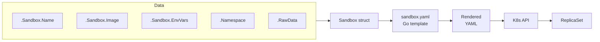
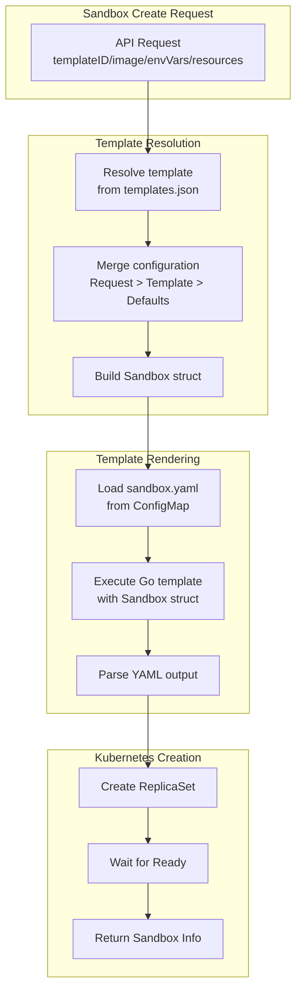

# Sandbox Template

Agent-Sandbox does not create Pods directly. Instead, it uses a Go template (`sandbox.yaml`) to dynamically generate a Kubernetes ReplicaSet for each sandbox. This template is called the **sandbox-template**.

Together with a [template](#) definition (from `templates.json`), the sandbox-template produces a concrete sandbox ReplicaSet:

```
sandbox-template (sandbox.yaml) + template (templates.json entry) = K8s ReplicaSet
```

## Why ReplicaSet

Using ReplicaSet instead of bare Pod gives Agent-Sandbox:

- **Lightweight**: No heavy CRD to install, uses built-in Kubernetes resources and controllers easy to understand and debug, important is that completely satisfy Sandbox's lifecycle management needs.
- **Self-healing**: If a sandbox Pod dies, the ReplicaSet recreates it automatically
- **Declarative state**: The sandbox's full configuration is stored in ReplicaSet annotations
- **Extensibility**: Users can customize the sandbox-template to add volumes, sidecars, or node scheduling

### In the future
- **HPA compatibility**: ReplicaSets are widely supported by Kubernetes features and tools, e.g. Horizontal Pod Autoscaler, etc.
- **Replicas**: We can support multi-replica Sandbox for distributed workloads or high availability.

---

## How It Works

When a sandbox creation request arrives:

1. The controller resolves the template, merges configuration, and builds a `Sandbox` struct
2. The `Sandbox` struct is passed into the sandbox-template Go template
3. The rendered output is parsed as a Kubernetes ReplicaSet YAML
4. The ReplicaSet is created in the target namespace





---

## Template Structure

The sandbox-template is a standard Kubernetes ReplicaSet YAML with Go template variables. Below is the default template with annotations:

```yaml
apiVersion: apps/v1
kind: ReplicaSet
metadata:
  name: {{.Sandbox.Name}}          # sandbox name, e.g. sbx-code-interpreter-abc123
  namespace: {{.Namespace}}         # target namespace
  annotations:
    sandbox-data:  |
      {{.RawData}}                  # JSON-serialized Sandbox struct
  labels:
    owner: agent-sandbox
    sandbox: {{.Sandbox.Name}}
    sbx-id: {{.Sandbox.ID}}         # unique ID (UUID without dashes)
    sbx-user: {{.Sandbox.User}}     # API key / user identifier
    sbx-template: {{.Sandbox.Template}}  # template name
    sbx-pool: {{.Sandbox.IsPool}}   # "true" for pool sandboxes
spec:
  replicas: 1
  selector:
    matchLabels:
      sandbox: {{.Sandbox.Name}}
  template:
    metadata:
      labels:
        sandbox: {{.Sandbox.Name}}
        owner: agent-sandbox
        sbx-id: {{.Sandbox.ID}}
        sbx-user: {{.Sandbox.User}}
        sbx-template: {{.Sandbox.Template}}
        sbx-pool: {{.Sandbox.IsPool}}
    spec:
      containers:
        - name: sandbox
          image: {{.Sandbox.Image}}   # resolved container image
          command: [{{.Sandbox.Cmd}}]  # optional: override CMD
          args:                        # optional: container args
            {{range .Sandbox.Args}}
            - {{ . }}
            {{end}}
          ports:
            - containerPort: {{.Sandbox.Port}}
          env:
            - name: INSTANCE_NAME
              valueFrom:
                fieldRef:
                  fieldPath: metadata.name
            {{range $name, $value := .Sandbox.EnvVars}}
            - name: {{$name}}
              value: {{printf "%q" $value}}
            {{end}}
          resources:
            requests:
              cpu: {{.Sandbox.CPU}}
              memory: {{.Sandbox.Memory}}
            limits:
              cpu: {{.Sandbox.CPULimit}}
              memory: {{.Sandbox.MemoryLimit}}
          startupProbe:               # optional: controlled by template's noStartupProbe
            failureThreshold: 600
            tcpSocket:
              port: {{.Sandbox.Port}}
            periodSeconds: 1
```

---

## Template Variables

The sandbox-template receives a `SandboxKube` struct:

```go
type SandboxKube struct {
    Sandbox   *Sandbox
    RawData   string    // JSON-serialized Sandbox struct
    Namespace string    // target Kubernetes namespace
}
```

### Sandbox Fields

| Variable | Type | Description |
|----------|------|-------------|
| `.Namespace` | string | Kubernetes namespace |
| `.Sandbox.Name` | string | Generated sandbox name (e.g. `sbx-code-interpreter-abc123`) |
| `.Sandbox.ID` | string | Unique ID (UUID without dashes) |
| `.RawData` | string | JSON-serialized sandbox for annotation storage |
| `.Sandbox.User` | string | API key or user identifier |
| `.Sandbox.Template` | string | Template name |
| `.Sandbox.Image` | string | Resolved container image |
| `.Sandbox.Port` | int | Service port (default: 8080) |
| `.Sandbox.Cmd` | string | Container command override |
| `.Sandbox.Args` | []string | Container arguments |
| `.Sandbox.EnvVars` | map[string]string | Environment variables from request |
| `.Sandbox.CPU` | string | CPU request |
| `.Sandbox.Memory` | string | Memory request |
| `.Sandbox.CPULimit` | string | CPU limit |
| `.Sandbox.MemoryLimit` | string | Memory limit |
| `.Sandbox.IsPool` | bool | Whether this is a pool ReplicaSet |

Full list of fields can be found in the `pkg/sandbox/sandbox.go` struct definition in the codebase.

### Conditional Blocks

The template supports Go conditionals and ranges:

```yaml
{{if .Sandbox.Cmd}}
command: [{{.Sandbox.Cmd}}]
{{end}}

{{if .Sandbox.Args}}
args:
{{range .Sandbox.Args}}
  - {{ . }}
{{end}}
{{end}}

{{if .Sandbox.EnvVars}}
{{range $name, $value := .Sandbox.EnvVars}}
- name: {{$name}}
  value: {{printf "%q" $value}}
{{end}}
{{end}}

{{if not .Sandbox.TemplateObj.NoStartupProbe}}
startupProbe:
  ...
{{end}}
```

---

## Hot Reload

The sandbox-template is stored in a ConfigMap alongside template definitions:

| ConfigMap Key | Content |
|---------------|---------|
| `config-sandbox-template` | Go template for ReplicaSet YAML |
| `config-templates` | JSON array of template definitions |

The controller watches the ConfigMap and reloads the sandbox-template on change — no restart required.

---

## API Endpoints

Manage the sandbox-template via REST API:

```
GET  /api/v1/config/sandbox-template   # Get current sandbox-template
POST /api/v1/config/sandbox-template   # Update sandbox-template
```

Also supports template management within the UI.

---

## Customization

You can modify the sandbox-template to fit your infrastructure:

### Volumes

**NAS:**
```yaml
spec:
  containers:
    - name: sandbox
      volumeMounts:
        - mountPath: /data/
          name: sb-data
  volumes:
    - name: sb-data
      nfs:
        path: /data/
        server: nas.ip
```

### Node Scheduling

```yaml
spec:
  nodeSelector:
    xxx/instance-type: xxx-node
  tolerations:
    - effect: NoSchedule
      key: xxx/instance-type
      operator: Equal
      value: xxx-node
```

### Private Registries

```yaml
spec:
  imagePullSecrets:
    - name: regsecret-enterprise
```

### Sidecar Containers

Add additional containers for logging, metrics, or CSI support:

```yaml
spec:
  initContainers:
    - name: sidecar
      restartPolicy: Always # sidecar long-running, not just init, k8s version 1.28+ supports initContainers with restartPolicy Always
      ...
  containers:
    - name: sandbox
      ...
```


