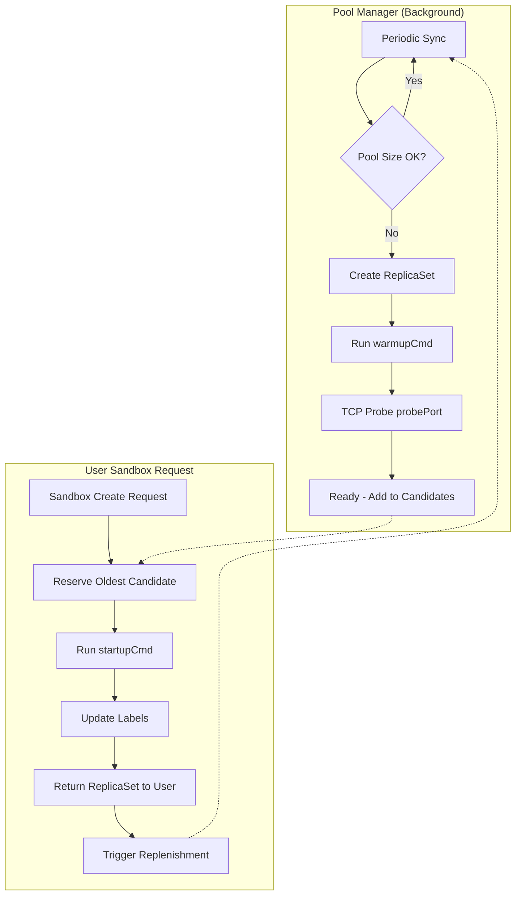
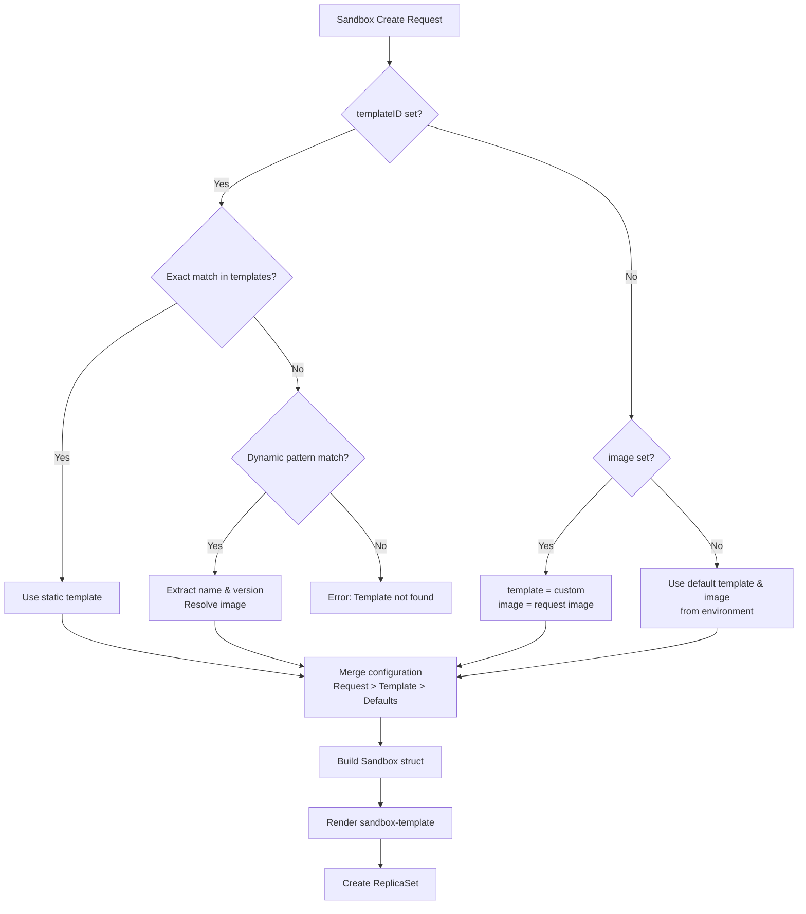

# Templates

Templates define the types of sandboxes available in Agent-Sandbox. Each template specifies a container image, resources, and optional pool configuration.

Together with the [sandbox-template](sandbox-template.md), a template produces a concrete Kubernetes ReplicaSet:

```
sandbox-template (sandbox.yaml) + template (templates.json entry) = K8s ReplicaSet
```

---

## Template Types

### Static Template

A static template has a fixed container image:

```json
{
  "name": "code-interpreter",
  "image": "ghcr.io/agent-sandbox/code-interpreter:0.4.0",
  "port": 49999,
  "resources": {
    "cpu": "0.2",
    "memory": "200Mi",
    "cpuLimit": "1",
    "memoryLimit": "1Gi"
  },
  "description": "E2B-compatible code interpreter environment"
}
```

Use static templates when you have a known, stable image.

### Dynamic Template

A dynamic template allows you to define **one template for a family of images**, instead of creating a separate template for each image version.

#### Why Dynamic Template?

The E2B API and SDK do not support specifying a container image directly when creating a sandbox. You must pass a `templateID` that references a pre-defined template. This creates a problem: **if you have many image variants (different name, versions) at one scenario**, you would need to define a template for each one.

Dynamic templates solve this by embedding the image name and version into the `templateID` itself. The controller extracts them via regex pattern matching, so you can:

- **Avoid pre-registration**: No need to define a template for every image version in advance
- **Specify any image via templateID**: Pass a `templateID` that matches the pattern, and the image is resolved automatically
- **One pattern covers all**: A single template definition handles unlimited image variants

#### Example

```json
{
  "name": "faas-code",
  "pattern": "faas-code-(?P<name>.+)\\.(?P<version>.+)$",
  "image": "ghcr.io/agent-sandbox/<name>:<version>",
  "type": "dynamic",
  "port": 49999,
  "description": "Dynamic code interpreter for any runtime"
}
```

With E2B SDK:

```python
# Create sandbox with python 3.11 runtime
sandbox = Sandbox.create(templateID="faas-code-python.3.11")

# Create sandbox with nodejs 18 runtime
sandbox = Sandbox.create(templateID="faas-code-nodejs.18")

# Create sandbox with go 1.21 runtime
sandbox = Sandbox.create(templateID="faas-code-golang.1.21")
```

All these requests match the same dynamic template. The pattern extracts `name` and `version`, producing:

| templateID | name | version | Resolved Image |
|------------|------|---------|----------------|
| `faas-code-python.3.11` | python | 3.11 | `ghcr.io/agent-sandbox/python:3.11` |
| `faas-code-nodejs.18` | nodejs | 18 | `ghcr.io/agent-sandbox/nodejs:18` |
| `faas-code-golang.1.21` | golang | 1.21 | `ghcr.io/agent-sandbox/golang:1.21` |

#### Pattern Requirements

- Must include `(?P<name>...)` capture group for the image name
- Must include `(?P<version>...)` capture group for the image version/tag
- The `image` field uses `<name>` and `<version>` as placeholders

Use dynamic templates when you have a family of images following a consistent naming pattern.

---

## Template Fields

| Field | Type | Required | Description |
|-------|------|----------|-------------|
| `name` | string | yes | Template identifier (used as `templateID` in API) |
| `image` | string | yes* | Container image. Use `<name>` and `<version>` placeholders for dynamic templates |
| `pattern` | string | no | Regex pattern for dynamic templates. Must include `(?P<name>...)` and `(?P<version>...)` capture groups |
| `type` | string | no | Set to `"dynamic"` to enable pattern matching |
| `port` | int | no | Main service port (default: 8080) |
| `description` | string | yes | Human-readable description |
| `resources` | object | no | CPU/memory requests and limits |
| `pool` | object | no | Pool configuration for warm sandboxes |
| `noStartupProbe` | bool | no | Disable TCP startup probe in sandbox-template |
| `args` | array | no | Default container arguments |
| `metadata` | object | no | Custom key-value pairs merged into sandbox metadata |

\* `image` is required for static templates. Dynamic templates resolve the image from the pattern.

---

### Resources

Define CPU and memory for sandbox containers:

```json
{
  "resources": {
    "cpu": "0.2",
    "memory": "200Mi",
    "cpuLimit": "1",
    "memoryLimit": "1Gi"
  }
}
```

| Field | Description |
|-------|-------------|
| `cpu` | CPU request (e.g., `"0.2"` = 200m) |
| `memory` | Memory request (e.g., `"200Mi"`) |
| `cpuLimit` | CPU limit (e.g., `"1"` = 1000m) |
| `memoryLimit` | Memory limit (e.g., `"1Gi"`) |

These values become the default for sandboxes created from this template. API requests can override them.

---

## Pool Configuration

Templates can define a pool to pre-create warm sandboxes for instant allocation.

### Two-Phase Startup

Agent-Sandbox's pool innovation is the **two-phase startup** design with `warmupCmd` and `startupCmd`, balancing fast startup time with low resource overhead.

Unlike other pool implementations that :

- **Fully pre-start everything**: Fast allocation but high idle resource cost

Agent-Sandbox splits initialization into two stages:

| Phase | Command | When | Purpose | Resource Impact |
|-------|---------|------|---------|-----------------|
| **Warmup** | `warmupCmd` | Pool creation (once) | Start lightweight processes, preload dependencies | Low CPU/memory |
| **Startup** | `startupCmd` | User acquisition (each time) | Start user-facing services | Full resources needed |

#### Example: E2B Code Interpreter

```json
{
  "name": "code-interpreter",
  "pool": {
    "size": 3,
    "probePort": 8888,
    "warmupCmd": "/root/.server/warmup.sh",
    "startupCmd": "/root/.server/startup.sh",
    "resources": {
      "cpu": "0",
      "memory": "60Mi",
      "cpuLimit": "0.2",
      "memoryLimit": "100Mi"
    }
  }
}
```

**warmup.sh** starts Jupyter kernel (lightweight, ~50Mi memory, near-zero CPU):

```bash
#!/bin/bash
# Start Jupyter in warm mode - ready but not serving
jupyter kernel --kernel-name=python3 --WarmupMode=true
```

**startup.sh** starts envd and connects the runtime when a user acquires the sandbox:

```bash
#!/bin/bash
# Start envd service and connect Python runtime
envd start --port 49999
jupyter connect
```

**Results:**

| Metric | Value |
|--------|-------|
| Sandbox creation time | **< 1 second** |
| Idle pool CPU | **0 (0m)** |
| Idle pool memory | **~57 Mi** |

This design enables maintaining a large pool of warm sandboxes at minimal cost, while still delivering sub-second allocation when a user requests a sandbox.

### Pool Fields

```json
{
  "pool": {
    "size": 3,
    "probePort": 8888,
    "warmupCmd": "/root/.server/warmup.sh",
    "startupCmd": "/root/.server/startup.sh",
    "resources": {
      "cpu": "0",
      "memory": "60Mi",
      "cpuLimit": "0.2",
      "memoryLimit": "100Mi"
    }
  }
}
```

| Field | Description |
|-------|-------------|
| `size` | Number of warm sandboxes to maintain |
| `probePort` | Port for TCP startup probe during pool creation |
| `warmupCmd` | Command to run during pool initialization. Format: `command,arg1 arg2` (comma-separated) |
| `startupCmd` | Command to run when adapting pool to user sandbox |
| `resources` | Resource settings for pool containers (typically lower than production) |

### Pool Lifecycle

1. **Replenishment**: Pool manager periodically creates ReplicaSets to maintain `size`
2. **Warmup**: Each pool ReplicaSet runs `warmupCmd` (e.g., start Jupyter in warm mode)
3. **Ready state**: TCP probe on `probePort` confirms readiness
4. **Acquisition**: On sandbox request, the oldest ready ReplicaSet is reserved
5. **Startup**: `startupCmd` starts user-facing services (e.g., envd, runtime connection)
6. **Adaptation**: Labels are updated (`sbx-pool=false`, `sbx-user=...`)
7. **Return**: The adapted ReplicaSet is returned to the user



---

## How It Works

When you create a sandbox with `templateID`:



### 1. Exact Match (Static)

```json
// templates.json
{"name": "code-interpreter", "image": "ghcr.io/agent-sandbox/code-interpreter:0.4.0", ...}
```

```
templateID=code-interpreter → exact match → image resolved
```

### 2. Pattern Match (Dynamic)

```json
// templates.json
{"name": "code-interpreter-biz", "type": "dynamic", "pattern": "faas-code-(?P<name>.+)\\.(?P<version>.+)$", ...}
```

```
templateID=faas-code-python.3.11 → pattern match → image=ghcr.io/agent-sandbox/python:3.11
```

### 3. No Template (Custom Image)

If `templateID` is not set but `image` is provided:

```
image=ghcr.io/my-org/my-image:latest → template name becomes "custom"
```

### 4. Default

If neither `templateID` nor `image` is set:

```
→ use SANDBOX_DEFAULT_TEMPLATE and SANDBOX_DEFAULT_IMAGE from environment
```

---

### Configuration Merging

When creating a sandbox, configuration is merged in this priority order (highest wins):

1. **API request parameters**: Values from `POST /e2b/v1/sandboxes` or `POST /api/v1/sandbox`
2. **Template defaults**: Values from the matched template in `templates.json`
3. **Global defaults**: Hardcoded fallbacks in the controller

Example: If a request specifies `cpu: "500m"` but the template defines `cpu: "200m"`, the request value (`500m`) is used.

---

## Hot Reload

Templates are stored in a ConfigMap:

| ConfigMap Key | Content |
|---------------|---------|
| `config-templates` | JSON array of template definitions |

The controller watches the ConfigMap and reloads templates on change — no restart required.

### Initial Load

On first startup, if the ConfigMap is empty, the controller loads from `config/templates.json` (or `SANDBOX_TEMPLATES_CONFIG_FILE`) and saves to the ConfigMap.

---

### API Endpoints

Manage templates via REST API:

```
GET  /api/v1/config/templates    # List all templates
POST /api/v1/config/templates    # Update templates (full replacement)
```

Templates can also be managed in the Web UI.

---

## Example Template Definitions

### Minimal Template

```json
{
  "name": "python",
  "image": "python:3.11-slim",
  "description": "Python 3.11 environment"
}
```

### Full Template with Pool

```json
{
  "name": "code-interpreter",
  "image": "ghcr.io/agent-sandbox/code-interpreter:0.4.0",
  "port": 49999,
  "resources": {
    "cpu": "0.2",
    "memory": "200Mi",
    "cpuLimit": "1",
    "memoryLimit": "1Gi"
  },
  "pool": {
    "size": 3,
    "probePort": 8888,
    "warmupCmd": "/root/.server/warmup.sh",
    "startupCmd": "/root/.server/startup.sh",
    "resources": {
      "cpu": "0",
      "memory": "60Mi",
      "cpuLimit": "0.2",
      "memoryLimit": "100Mi"
    }
  },
  "noStartupProbe": false,
  "description": "E2B-compatible code interpreter environment"
}
```

### Dynamic Template

```json
{
  "name": "runtime",
  "pattern": "^(?P<name>[a-z]+)-(?P<version>[0-9.]+)$",
  "image": "ghcr.io/runtimes/<name>:<version>",
  "type": "dynamic",
  "port": 8080,
  "description": "Generic runtime template for versioned environments"
}
```

---

## Best Practices

### Naming

- Use lowercase, hyphen-separated names: `code-interpreter`, `nodejs-runtime`
- Keep names short but descriptive

### Resources

- Set `cpu` and `memory` to typical usage, not maximum
- Set limits 2-5x higher than requests for burst capacity
- Use lower `pool.resources` to save cost on warm sandboxes

### Pool

- Only enable pools for frequently used templates
- Size pools based on expected concurrent usage
- Use `warmupCmd` for slow initialization (package installs, model downloads)
- Use `startupCmd` for fast service startup

### Dynamic Templates

- Keep patterns specific to avoid unintended matches
- Always include both `(?P<name>...)` and `(?P<version>...)` capture groups
- Test patterns with expected template IDs before deploying